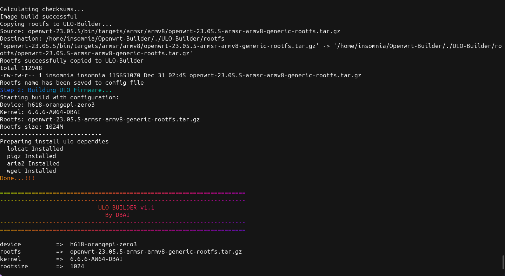
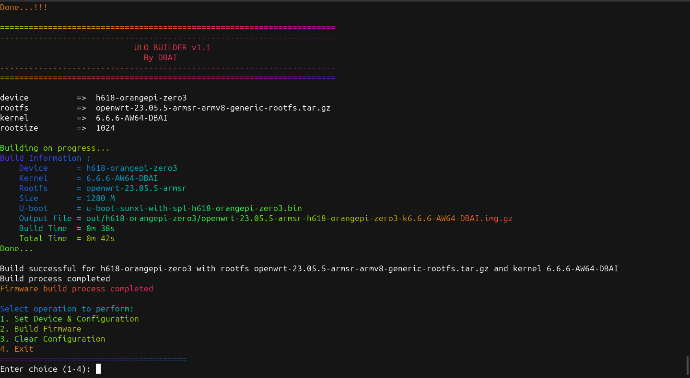

# OpenWrt Builder


Script untuk mempermudah pembuatan firmware OpenWrt menggunakan ULO-Builder dan OpenWrt Image Builder dalam satu kali klik.

## Fitur

- Pemilihan device yang didukung (AllWinner, Rockchip, Amlogic)
- Pemilihan versi OpenWrt (23.05.0 - 23.05.5)
- Otomatis memilih kernel yang sesuai dengan device
- Build OpenWrt Image dan ULO Firmware dalam satu proses
- Manajemen konfigurasi yang mudah

## Device yang Didukung

 ### Amlogic
     s905x (HG680P, B860Hv1/v2)
     s905x2 (HG680FJ, B860Hv5, MNC CYBORG001)
     s905x3 
     s905x4 (AKARI AX810, dll)

 ### Allwinner
     H5 (Orange Pi Zero Plus 2, Orange Pi Zero Plus, Orange Pi Prime, Orange Pi PC2)
     H6 (Orange Pi 1 Plus, Orange Pi Lite 2, Orange Pi 3 LTS, Orange Pi 3)
     H616 (Orange Pi Zero 2)
     H618 (Orange Pi Zero 3, Orange Pi Zero 2W)

 ### Rockchip
     RK3566 (Orange Pi 3B)
     RK3588S (Orange Pi 5)
     RK3588 (Orange Pi 5 Plus)


### Install depedensi Ulo-builder
```
sudo apt update && sudo apt install lolcat, pigz, aria2
```

### debian / Ubuntu / Mint

***Modernized set for Ubuntu 24.04 that has Python 3.12 without python3-distutils: (OpenWrt main/master in Apr 2024)***

``` bash
sudo apt update
sudo apt install build-essential clang flex bison g++ gawk \
gcc-multilib g++-multilib gettext git libncurses5-dev libssl-dev \
python3-setuptools rsync swig unzip zlib1g-dev file wget
```

***set for Ubuntu 22.04 (that has older Python 3.xx):***
``` bash
sudo apt update
sudo apt install build-essential clang flex bison g++ gawk \
gcc-multilib g++-multilib gettext git libncurses-dev libssl-dev \
python3-distutils python3-setuptools rsync swig unzip zlib1g-dev file wget
```

### Install dan configurasi
- 1 clone repo ini
``` bash
git clone https://github.com/bobbyunknown/Openwrt-Builder.git
cd Openwrt-Builder
```
- 2 jalankan script build pilih 1 untuk configurasi device dan versi openwrt
``` bash
./build
```
- 3 Setelah configurasi selesai pilih 2 untuk build openwrt image

#### Note
> ***Jika ingin menambah package sesuaikan di folder package "Untuk package yang tidak ada di repo openwrt" Cukup tambahkan file IPK saja***
> ***Ubah jika di belakang nama package ada - misal nya luci-app-syscontrol-12_1_2.ipk Ubah menjadi luci-app-syscontrol_12_1_2.ipk (-) menjadi (_) Underscore***
> ***Jika ingin menambahkan package yang ada di repo openwrt, cukup tambahkan package di file config-package misal nya driver dan lain-lain***

### Tambahan 
***Jika tidak ada pc/laptop atau tidak terinstall linux, bisa menggunakan github action dengan cara fork repo ini***
> [https://github.com/bobbyunknown/Openwrt-Builder/fork](https://github.com/bobbyunknown/Openwrt-Builder/fork)
- ***Setelah di fork, klik action lalu pilih ULO Autobuilder (Sesuaikan dengan device dan versi openwrt)***


## Screenshot

<details>
<summary>Klik untuk melihat screenshot</summary>


*Pemilihan Device*


*Proses Build Image*


*Build Selesai*

</details>


### Credit
- Thank to Allah
- Ulo-builder
- DBAI
- Indo-WRT
